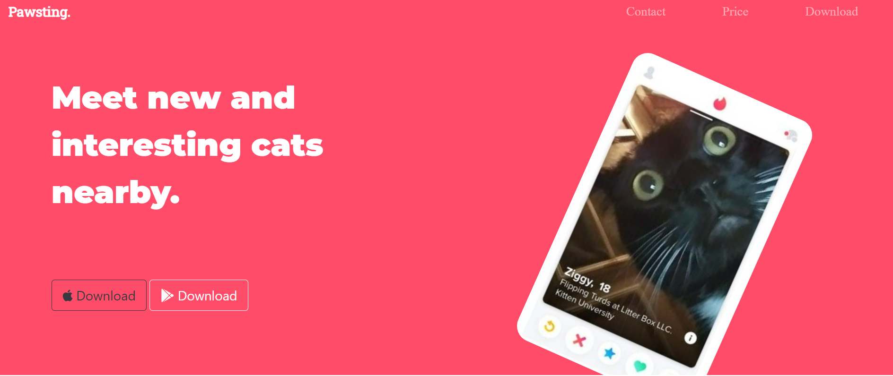
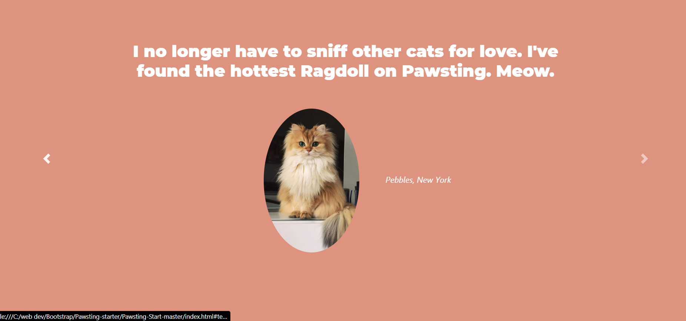
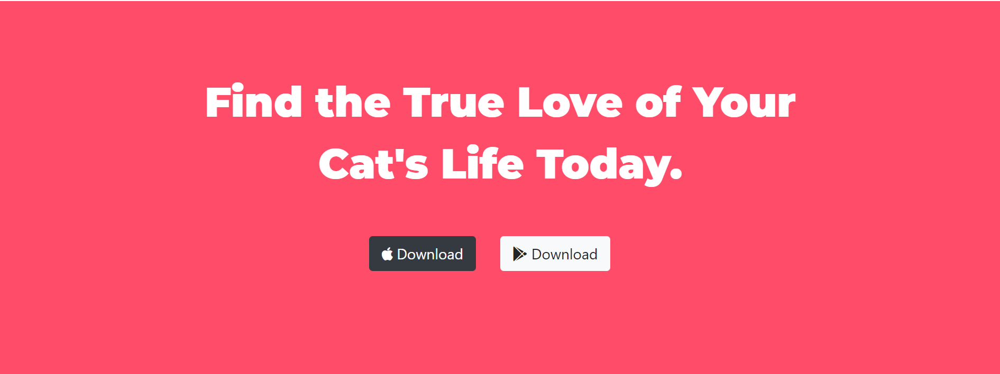

# Pawsting | Meet Cats 😸

✨Find the love of your cat's life! ✨

## How it Works 
This is a landing page for a fictional dating app for cat owners to help their furry friends find soulmates. A user is able to scroll or click through to view the various sections of the SPA.

## Tools Used
The main framework used in building the Pawsting website is Bootstrap and its components like Carousel, Card, Buttons, Navbar etc. It also used HTML5, CSS3 and Google Fonts and Font Awesome.

## Screenshots 
 

## Nitty Gritty 
Based on one of the projects from Angela Yu's Udemy Web Development course, this single page web app was built with HTML and Bootstrap 4.0.
